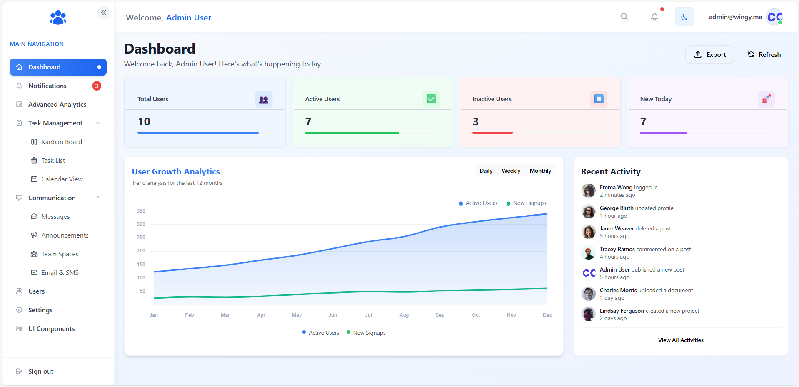
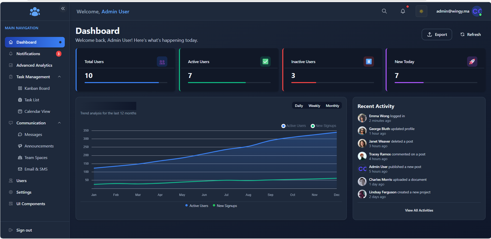
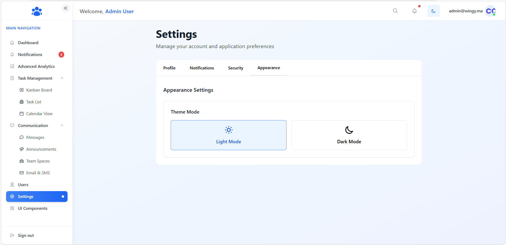
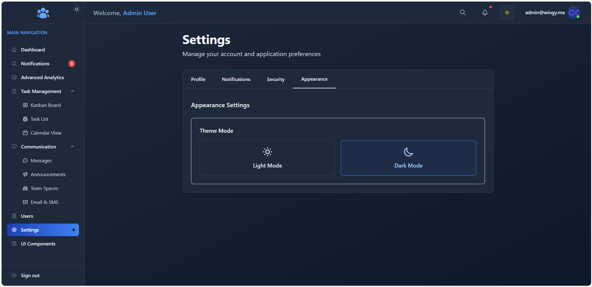

# Modern Admin Dashboard

A comprehensive, feature-rich admin dashboard built with React.js, Redux Toolkit, React Router, and Tailwind CSS.

## Links

[](https://github.com/LamouadeneWissal/my_admin_dashboard_React)
[](https://my-admin-dashboard-react-1bbls0lpk-lamouadenewissals-projects.vercel.app)

## Project Overview

### Sign-in Page

*Clean login interface with email and password validation*

### Dashboard (Light Mode)

*Dashboard overview in light mode with key statistics, growth chart, and recent activities*

### Dashboard (Dark Mode)

*The same dashboard in dark mode for an alternative visual experience*

### Users Management

*User management interface with sorting, filtering, and actions*


*Advanced search functionality for users*


*User management in dark mode*

### Notifications Center
*[Add screenshot here]*
*Centralized notifications center with filtering and management options*

### Communication Tools
*[Add screenshots here]*
*Communication hub with messaging, announcements, and team spaces*

### Task Management Views
*[Add screenshots here]*
*Multiple views for task and project management*

## Features

### Core Dashboard
- **Authentication**: Login/logout functionality with form validation
- **Dashboard Overview**: Displays key metrics, statistics, and user growth chart
- **Dark/Light Mode**: Customizable theme with easy toggle between modes
- **Responsive Interface**: Design adapted to all devices
- **Interactive Analytics**: Real-time data visualization with advanced charts
- **Personalized Settings**: Settings page with multiple tabs (Profile, Notifications, Security, Appearance)

### User Management
- **User Directory**: Display users in a sortable, filterable table
- **Search and Filtering**: Advanced search with multiple filters
- **User Actions**: Enable/disable users via toggle switch
- **Bulk Operations**: Select and manage multiple users simultaneously
- **User Details**: Comprehensive user profiles with activity history
- **Pagination**: Built-in pagination for large datasets

### Task Management (New!)
- **Project-Based Organization**: Tasks organized within projects
- **Multiple Views**:
  - **Kanban Board**: Visual drag-and-drop task management
  - **Task List**: Filterable tabular view of all tasks
  - **Calendar View**: Timeline visualization of tasks and deadlines
- **Task Details**: Comprehensive task information with descriptions and metadata
- **Priority Levels**: Visual indicators for task importance
- **Status Tracking**: Monitor progress with custom status workflows
- **Project Timeline**: Track project phases and milestones

### Notifications Center (New!)
- **Real-time Alerts**: Instant notifications for important events
- **Notification Inbox**: Centralized location for all system messages
- **Read/Unread Status**: Track which notifications have been viewed
- **Filter Options**: Filter by type, priority, date, and more
- **Action Buttons**: Perform relevant actions directly from notifications
- **Badge Counter**: Shows unread notification count in the sidebar

### Communication Tools (New!)
- **Internal Messaging**: Direct messaging between users with conversation history
- **Announcement Broadcasts**: System-wide and targeted announcements
- **Team Spaces**: Collaborative areas for team discussions
- **Email & SMS Integration**: Template management and delivery options

### Advanced Analytics (New!)
- **Interactive Dashboards**: Enhanced data visualization with real-time updates
- **Custom Reports**: Generate reports based on various metrics
- **Performance Metrics**: Track KPIs and business metrics
- **Data Filtering**: Advanced filtering controls for analytics data
- **Real-time Charts**: Dynamic charts with interactive elements

## Technical Stack

- **React 19.1.0** (with Vite) - Frontend library with the latest features
- **Redux Toolkit** - State management with slices and async thunks
- **React Router v7** - Navigation and routing with the latest features
- **Tailwind CSS** - Utility-first CSS framework for UI components
- **Chart.js & Recharts** - Data visualization libraries for interactive charts
- **Shadcn UI** - Component system built on Radix UI primitives
- **Date-fns** - Date manipulation library
- **React Beautiful DnD** - Drag and drop for Kanban interface

## Quick Start

### Prerequisites

- Node.js (v18.0.0 or later recommended)
- npm (v8.0.0 or later recommended)

### Installation

1. Clone the repository
```bash
git clone https://github.com/YourUsername/my-admin-dashboard.git
cd my-admin-dashboard
```

2. Install dependencies
```bash
npm install
```

3. Start the development server
```bash
npm run dev
```
The application will be available at `http://localhost:5173` (or another port if this one is already in use)

4. Build for production
```bash
npm run build
```

## Login Credentials

- Email: `admin@wingy.com`
- Password: `admin123`

## Project Structure

```
src/
├── assets/           # Images, icons, and other static assets
├── components/       # Reusable components
│   ├── ui/           # Shadcn UI components
│   └── ...           # Other custom components
├── context/          # React contexts (ThemeContext, SidebarContext)
├── data/             # Static data and mock APIs
│   ├── communications.js  # Communication tools data & API
│   ├── notifications.js   # Notifications data & API
│   ├── projects.js        # Project management data & API
│   └── users.js           # User data & API
├── lib/              # Utilities and helpers
├── pages/            # Main application pages
│   ├── communication/    # Communication tools pages
│   ├── Notifications/    # Notifications center pages
│   ├── task-management/  # Task management pages
│   └── ...               # Core pages (Dashboard, Users, Settings)
├── redux/            # Redux configuration and slices
└── utils/            # Utility functions
```

## API Integration

The dashboard integrates with multiple data sources:
- DummyJSON API (https://dummyjson.com/users) for user data
- Internal mock APIs for communications, notifications, and task management
- Extensible architecture ready for real backend integration

## Additional Features

### Customization Options
- **Theme Customization**: Detailed theme settings with color preference
- **Layout Options**: Adjustable layout settings for optimal user experience
- **Notification Preferences**: Configure notification delivery and frequency

### Performance Optimizations
- **Lazy Loading**: Components loaded only when needed
- **Virtualized Lists**: Efficient rendering for large datasets
- **Memo and Callback Usage**: Prevents unnecessary re-renders

### Accessibility
- **Keyboard Navigation**: Full keyboard accessibility support
- **ARIA Attributes**: Proper accessibility markup throughout the application
- **Focus Management**: Logical tab order and focus indicators

## Screenshots Gallery

*[Additional screenshots can be added here]*

### Gestion des utilisateurs

*Liste des utilisateurs avec options pour modifier leur statut et les supprimer*


*Vue détaillée des informations utilisateurs avec pagination*

### Recherche d'utilisateurs

*Fonction de recherche permettant de filtrer rapidement les utilisateurs*

### Mode sombre pour la gestion des utilisateurs

*Interface de gestion des utilisateurs en mode sombre*

### Page des paramètres (Mode clair)

*Page des paramètres avec différents onglets pour personnaliser l'expérience utilisateur*

### Page des paramètres (Mode sombre)

*Page des paramètres en mode sombre, montrant la cohérence du design dans tous les thèmes*

## Fonctionnalités implémentées

- [x] **Authentification**: Login/Logout avec redirection protégée
- [x] **Interface Admin Dashboard**: Layout avec Sidebar + Topbar
- [x] **Navigation**: Entre /dashboard, /users, /settings et /login
- [x] **Gestion des utilisateurs**:
  - [x] Intégration Redux + AsyncThunk pour récupérer les utilisateurs
  - [x] Affichage des utilisateurs dans un tableau
  - [x] Switch pour activer/désactiver l'utilisateur
  - [x] Bouton Supprimer pour retirer un utilisateur
  - [x] Champ de recherche (filtrage local)
  - [x] Pagination avec boutons Précédent/Suivant
- [x] **Mode sombre**: Implémentation complète avec ThemeContext
- [x] **Tableau de bord**: Statistiques, graphiques et activités récentes
- [x] **Page de paramètres**: Onglets multiples avec sauvegarde des préférences

## Déploiement sur Vercel

Le projet est déployé en ligne via [Vercel](https://vercel.com).  
🔗 **Accéder au site en production :**  
👉 [https://my-admin-dashboard-react-1bbls0lpk-lamouadenewissals-projects.vercel.app](https://my-admin-dashboard-react-1bbls0lpk-lamouadenewissals-projects.vercel.app)

### Étapes pour déployer :

1. Créer un compte sur [vercel.com](https://vercel.com)
2. Connecter votre compte GitHub à Vercel
3. Importer le dépôt GitHub : `LamouadeneWissal/my_admin_dashboard_React`
4. Vercel détecte automatiquement que c’est un projet React et propose des paramètres par défaut
5. Lancer le déploiement 🚀

> Le site est automatiquement redéployé à chaque push sur la branche `main`.

---

## Développement et Amélioration

Pour contribuer au projet :

1. Forker le dépôt  
2. Créer une branche pour votre fonctionnalité (`git checkout -b feature/amazing-feature`)  
3. Commiter vos changements (`git commit -m 'Ajouter une fonctionnalité incroyable'`)  
4. Pusher vers la branche (`git push origin feature/amazing-feature`)  
5. Ouvrir une Pull Request

---

## Remerciements

- [DummyJSON](https://dummyjson.com) pour l'API de démonstration  
- [Tailwind CSS](https://tailwindcss.com/) pour le framework CSS  
- [Chart.js](https://www.chartjs.org/) pour les visualisations de données
- [2N CODE](https://www.2ncode.com/#features) pour l’opportunité de réaliser ce projet.


